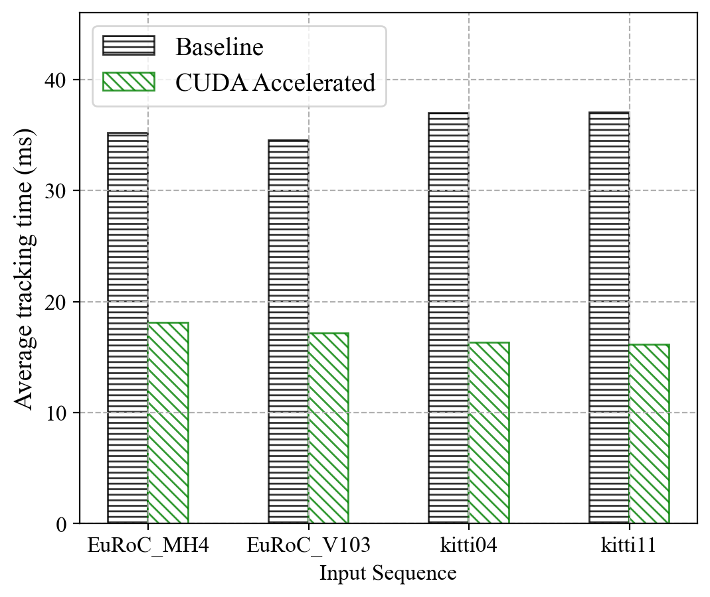

# CUDA Accelerated ORB-SLAM2

This is a CUDA accelerated version of the [ORB-SLAM2](https://github.com/raulmur/ORB_SLAM2). OpenCV CUDA library, custom CUDA kernels, and pipeline execution are used to accelerate the bottleneck functions.

The algorithm is tested with the [EuRoC dataset](http://projects.asl.ethz.ch/datasets/doku.php?id=kmavvisualinertialdatasets) and the [KITTI dataset](http://www.cvlibs.net/datasets/kitti/eval_odometry.php). The test results show that a ***2x end-to-end speedup*** is achieved.

# Acknowledgment
This is a course project of CSC2231 at University of Toronto supervised by Professor Nandita Vijaykumar.
